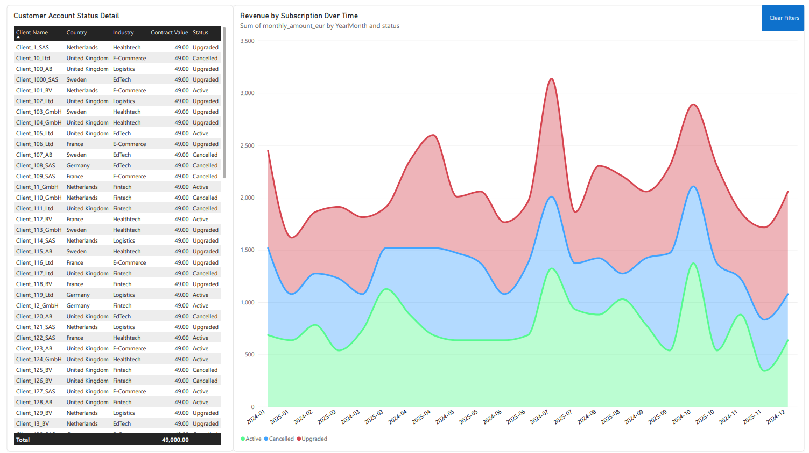

# 📈 B2B SaaS Revenue & Customer Retention Intelligence Engine

> An end-to-end business intelligence engine designed to model €49K ARR subscription lifecycles, isolate revenue leakage, and diagnose account churn across multi-tier SaaS cohorts.


---

##  Tech Stack & Architecture
- **Database Layer:** PostgreSQL (Relational Schema Design, Foreign Key Constraints, Table Normalization)
- **Transformation & Querying:** Analytical SQL (Aggregations, Window Functions, Inner/Left Joins)
- **Semantic Layer & Analytics:** Microsoft Power BI, Star Schema Modeling
- **Business Logic & Metrics:** Advanced DAX (Variable Scoping, Filter Context Manipulation)

---

##  Business Logic & Metric Formulations

### 1. Active Monthly Recurring Revenue (MRR)
Isolates active subscription cash flow while respecting visual filter contexts:
$$\text{Active MRR} = \sum_{i \in \text{Active}} \text{Amount}_i$$

### 2. Cancelled MRR (Revenue Leakage)
Aggregates churned subscription value across lost accounts to target retention interventions:
$$\text{Cancelled MRR} = \sum_{i \in \text{Cancelled}} \text{Amount}_i$$

### 3. Portfolio Churn Rate %
Evaluates portfolio health via dynamic baseline comparison:
$$\text{Churn Rate \%} = \left( \frac{\text{Cancelled MRR}}{\text{Active MRR} + \text{Cancelled MRR}} \right) \times 100$$

---

##  Key Insights Delivered
- **Revenue Leakage Isolation:** Diagnosed ARR drop-offs across specific customer tiers.
- **Dynamic Cohort Retention:** Visualized subscription life cycles using interactive time-series retention area curves.
- **Relational Data Integrity:** Ensured 100% referential integrity across dimensional entities via PostgreSQL primary and foreign key architectures.

##  Relational Schema Design (Star Schema)

The PostgreSQL data model is structured to separate high-frequency transaction facts from descriptive dimensional attributes:

* **Fact Tables:** `fact_subscriptions` (capturing transactional changes, MRR amounts, status timestamps, foreign key mapping).
* **Dimension Tables:** `dim_customers` (account tiers, acquisition channels, geographical metadata), `dim_date` (standard calendar dimensions supporting dynamic DAX time intelligence).
* **Referential Integrity:** Enforced primary and foreign key constraints across relational entities to ensure zero orphaned records.

---

##  Sample Measure Implementation

```sql
Portfolio Churn Rate % = 
VAR ActiveValue = [Active MRR]
VAR ChurnedValue = [Cancelled MRR]
VAR TotalBaseline = ActiveValue + ChurnedValue
RETURN
    DIVIDE(
        ChurnedValue,
        TotalBaseline,
        0
    )
```

