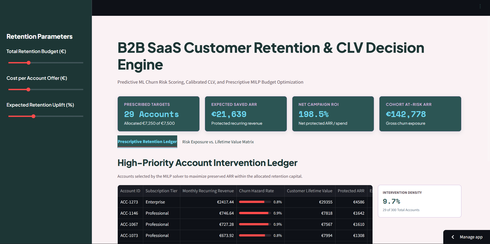
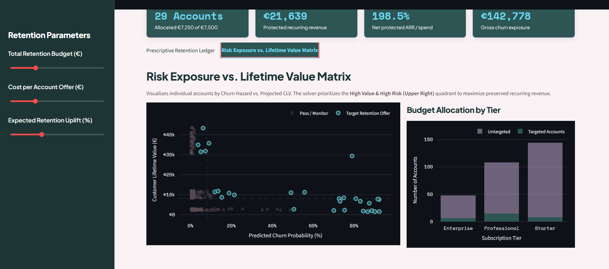

# 💎 B2B SaaS Predictive Retention & Revenue Decision Engine

[](https://b2b-saas-retention-dashboard-u8f2lyqeyovxzcpa6wnutz.streamlit.app/)
[](LICENSE)
[](https://www.python.org/)

An enterprise-grade Customer Revenue Operations (RevOps) platform integrating a **PostgreSQL relational star schema**, **Power BI strategic cohort intelligence**, **Gradient Boosting predictive churn/CLV modeling**, and a **PuLP Knapsack MILP optimization engine** to autonomously allocate retention budgets and maximize preserved Annual Recurring Revenue (ARR).

---

## 🎬 Live Engine & Dashboard Demos

### 1. Operational Decision Engine (Python & Streamlit)
https://github.com/user-attachments/assets/app.mp4

> **Live Prescriptive Optimizer:** Ingests account telemetry, outputs calibrated churn probabilities ($p_{\text{churn}}$), dynamically estimates Customer Lifetime Value ($\text{CLV}$), and solves an integer linear program (MILP) to target retention spend under budget ceilings.

### 2. Strategic BI Cohort Reporting (Power BI & DAX)


---

## 📸 Platform Previews

### 1. High-Priority Account Intervention Ledger (Streamlit)


### 2. Risk Exposure vs. Lifetime Value Matrix (Streamlit)


### 3. Executive Portfolio & Cohort BI Dashboard (Power BI)


---

## 📌 Two-Layer Architecture: From Historical BI to Prescriptive Action

                  ┌────────────────────────────────────────┐
                  │          PostgreSQL Warehouse          │
                  │  (Subscription Billing, Telemetry, SQL)│
                  └───────────────────┬────────────────────┘
                                      │
              ┌───────────────────────┴───────────────────────┐
              ▼                                               ▼
[Strategic BI Reporting]                        [Operational Decision Engine]
* Microsoft Power BI + DAX                      * Python (Scikit-Learn Gradient Boosting)
* Historical Cohort Retention Curves            * Dynamic CLV Estimation Engine
* Expansion vs. Contraction MRR                 * PuLP Prescriptive Knapsack MILP
* "What happened over the last 12 months?"      * "Who do we intervene on today to save ARR?"

---

## 🧮 Mathematical & Machine Learning Formulations

### 1. Predictive Churn Hazard Modeling ($p_i$)
Individual account churn probabilities are scored using a calibrated Gradient Boosting classifier evaluating engagement signals:

$$p_i = \sigma\left( \mathbf{w}^T \mathbf{x}_i + b \right) \in [0, 1]$$

Where feature vector $\mathbf{x}_i$ includes:
* $\text{Tenure}_i$: Account lifecycle maturity in months.
* $\text{Logins}_i$: Weekly session frequency.
* $\text{Tickets}_i$: Cumulative customer support escalations.
* $\text{LicenseUtilization}_i$: Active seat count divided by provisioned seats.
* $\text{Tier}_i$: Subscription plan (Starter, Professional, Enterprise).

### 2. Dynamic Customer Lifetime Value ($\text{CLV}_i$)
$$\text{CLV}_i = \frac{\text{MRR}_i \cdot \text{Gross Margin \%}}{\max\left(\frac{p_i}{12}, \lambda_{\text{floor}}\right)}$$

Where:
* $\text{MRR}_i$: Monthly Recurring Revenue.
* $\text{Gross Margin \%} = 80\%$ (SaaS industry benchmark).
* $\lambda_{\text{floor}} = 0.05$: Minimum annual baseline hazard rate.

### 3. Prescriptive Budget Optimization (PuLP Knapsack MILP)
Instead of assigning blanket retention discounts, the integer optimizer decides binary treatment assignments $x_i \in \{0, 1\}$:

$$\max_{x_i} \sum_{i=1}^{N} x_i \cdot \left[ \left( p_i \cdot \Delta_{\text{uplift}} \right) \cdot \text{CLV}_i - C_{\text{offer}} \right]$$

**Subject to:**
* **Budget Ceiling:**
  $$\sum_{i=1}^{N} x_i \cdot C_{\text{offer}} \le B_{\text{Retention}}$$
* **Binary Treatment:**
  $$x_i \in \{0, 1\} \quad \forall i \in \{1, \dots, N\}$$

### 4. Strategic Business Intelligence Measures (Power BI & DAX)
* **Active Monthly Recurring Revenue (MRR):**
  $$\text{Active MRR} = \sum_{i \in \text{Active}} \text{Amount}_i$$
* **Cancelled MRR (Revenue Leakage):**
  $$\text{Cancelled MRR} = \sum_{i \in \text{Cancelled}} \text{Amount}_i$$
* **Portfolio Churn Rate %:**
  $$\text{Churn Rate} = \left( \frac{\text{Cancelled MRR}}{\text{Active MRR} + \text{Cancelled MRR}} \right) \times 100$$

---

## 🛠️ Tech Stack

* **Prescriptive Optimization:** `PuLP` (COIN-OR CBC Solver)
* **Predictive ML:** `Scikit-Learn` (Gradient Boosting Classifier, StandardScaler)
* **Application Framework & Visualization:** `Streamlit Cloud`, `Plotly Express`, `Plotly Graph Objects`
* **Enterprise Business Intelligence:** `Microsoft Power BI`, `DAX`
* **Data Engineering & Database:** `PostgreSQL`, `Advanced SQL`, `Pandas`, `NumPy`

---

## 🏛️ Relational Schema & SQL Engineering

```text
[dim_customers] (customer_id PK) ──< [fact_subscriptions] (subscription_id PK, customer_id FK, start_date FK)
                                              │
[dim_date]      (date_key PK)    ─────────────┘

-- Monthly Active MRR & Period-over-Period Delta Calculation
WITH monthly_metrics AS (
    SELECT 
        d.year_month, 
        SUM(f.mrr_amount) AS current_mrr 
    FROM fact_subscriptions f 
    JOIN dim_date d ON f.start_date_key = d.date_key 
    WHERE f.status = 'Active' 
    GROUP BY d.year_month
) 
SELECT 
    year_month, 
    current_mrr, 
    LAG(current_mrr, 1, 0) OVER (ORDER BY year_month) AS previous_mrr, 
    (current_mrr - LAG(current_mrr, 1, 0) OVER (ORDER BY year_month)) AS mrr_growth_delta 
FROM monthly_metrics;


