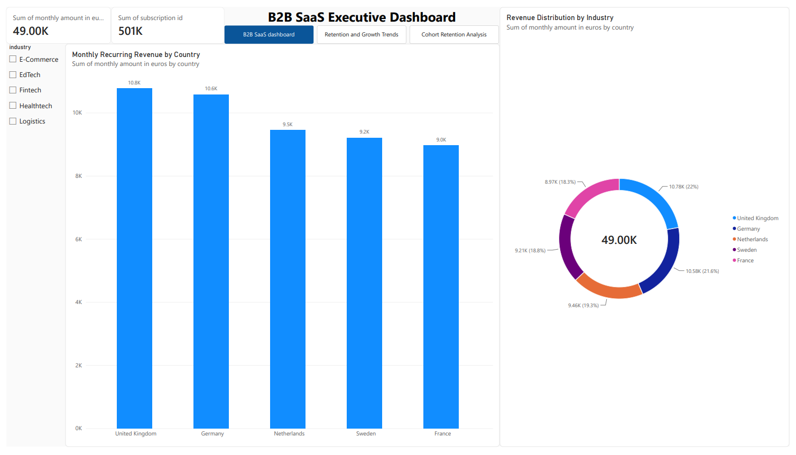
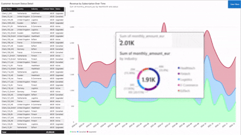

#  B2B SaaS Revenue & Customer Retention Intelligence Engine

> An end-to-end business intelligence engine designed to model **€49K ARR** subscription lifecycles, isolate revenue leakage, and diagnose account churn across multi-tier SaaS cohorts.


---

##  Tech Stack & Architecture

* **Database Layer:** PostgreSQL (Relational Schema Design, Foreign Key Constraints, Table Normalization)
* **Transformation & Querying:** Analytical SQL (Aggregations, Window Functions, Inner/Left Joins)
* **Semantic Layer & Analytics:** Microsoft Power BI, Star Schema Modeling
* **Business Logic & Metrics:** Advanced DAX (Variable Scoping, Filter Context Manipulation)

---

##  Business Logic & Metric Formulations

### 1. Active Monthly Recurring Revenue (MRR)
Isolates active subscription cash flow while respecting visual filter contexts:
$$\text{Active MRR} = \sum_{i \in \text{Active}} \text{Amount}_i$$

### 2. Cancelled MRR (Revenue Leakage)
Aggregates churned subscription value across lost accounts to target retention interventions:
$$\text{Cancelled MRR} = \sum_{i \in \text{Cancelled}} \text{Amount}_i$$

### 3. Portfolio Churn Rate %
Evaluates portfolio health via dynamic baseline comparison:
$$\text{Churn Rate} = \left( \frac{\text{Cancelled MRR}}{\text{Active MRR} + \text{Cancelled MRR}} \right) \times 100$$

---

##  Key Insights Delivered

* **Revenue Leakage Isolation:** Diagnosed ARR drop-offs across specific customer tiers.
* **Dynamic Cohort Retention:** Visualized subscription lifecycles using interactive time-series retention area curves.
* **Relational Data Integrity:** Ensured 100% referential integrity across dimensional entities via PostgreSQL primary and foreign key architectures.

---

##  Relational Schema & SQL Engineering

```text
[dim_customers] (customer_id PK) ──< [fact_subscriptions] (subscription_id PK, customer_id FK, start_date FK)
                                              │
[dim_date]      (date_key PK)    ─────────────┘
```

```sql
-- Monthly Active MRR & Period-over-Period Delta Calculation
WITH monthly_metrics AS (
    SELECT 
        d.year_month, 
        SUM(f.mrr_amount) AS current_mrr 
    FROM fact_subscriptions f 
    JOIN dim_date d ON f.start_date_key = d.date_key 
    WHERE f.status = 'Active' 
    GROUP BY d.year_month
) 
SELECT 
    year_month, 
    current_mrr, 
    LAG(current_mrr, 1, 0) OVER (ORDER BY year_month) AS previous_mrr, 
    (current_mrr - LAG(current_mrr, 1, 0) OVER (ORDER BY year_month)) AS mrr_growth_delta 
FROM monthly_metrics;
```

---

##  Sample DAX Measure Implementation

```dax
Portfolio Churn Rate % = 
VAR ActiveValue = [Active MRR] 
VAR ChurnedValue = [Cancelled MRR] 
VAR TotalBaseline = ActiveValue + ChurnedValue 
RETURN 
    DIVIDE( 
        ChurnedValue, 
        TotalBaseline, 
        0 
    )
```

---
